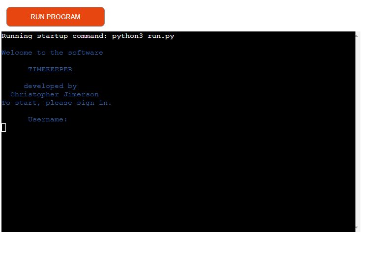

# TIMEKEEPER: Simple Time Keeping Software 

**Developer: Christopher Jimerson**

[Visit Live Site](https://time-keeper.herokuapp.com/)

## About
This project is a simple time management software that helps a user view, change, edit, and calculate hours for employees.

## Table of Contents
  - [Project Goals](#project-goals)
    - [User Goals](#user-goals)
    - [Site Owner Goals](#site-owner-goals)
  - [User Experience](#user-experience)
    - [Target Audience](#target-audience)
    - [User Requirements and Expectations](#user-requirements-and-expectations)
    - [User Manual](#user-manual)
  - [User Stories](#user-stories)
    - [Users](#users)
    - [Site Owner](#site-owner)
  - [Technical Design](#technical-design)
    - [Flowchart](#flowchart)
  - [Technologies Used](#technologies-used)
    - [Languages](#languages)
    - [Frameworks & Tools](#frameworks--tools)
    - [Libraries](#libraries)
  - [Features](#features)
  - [Validation](#validation)
  - [Testing](#testing)
    - [Manual Testing](#manual-testing)
    - [Automated Testing](#automated-testing)
  - [Bugs](#bugs)
  - [Deployment](#deployment)
  - [Credits](#credits)
  - [Acknowledgements](#acknowledgements)

## Project Goals

### User Goals

- Easily view the data for the employees stored in the database
- Easily move through the application with clear response to correct, or incorrect use
- Understand what is asked of me for each part of the application

### Site Owner Goals

- Create an easy to use system for a user to navigate and utilize
- Provide feedback on what a user does, correct or otherwise
- Give examples of data formats that are needed to use the system

## User Experience

### Target Audience

- This is targeted at users that have a small team and need to have an easy way to manage the times of their teams work

### User Requirements and Expectations

- A straight forward and error absent application
- Easy to understand navigation
- Clear purposes to each function
- Feedback from user input

### User Manual

For a more details view of the instructions on how-to-use, click here

#### Landing-Authentication

#### Employee Select

#### Main Menu

#### Menu One

#### Menu Two

#### Menu Three

#### Menu Four

#### Menu Five

[Back to Table Of Contents](#table-of-contents)

## User Stories

### Users

As a user...

1. I want to easily see employee working hours 
2. I want to know what menus are available
3. I want to see what employees are in our database
4. I want the software protected from just having anyone use it
5. I want to be able to edit existing data
6. I want to add new data for an employee
7. I want to know how many total hours are in the database for each of our employees
8. I want to easily navigate back to the beginning
9. I want feedback on my data input
10. I want to know that my changes have been successful

[Back to Table Of Contents](#table-of-contents)

## Technical Design

### Flowchart

## Technologies Used

### Languages
- [Python](https://www.python.org/) programming language for the logic of the program

### Frameworks & Tools
- [Git](https://git-scm.com/) was used for version control within VSCode to push the code to GitHub
- [GitHub](https://github.com/) was used as a remote repository to store project code
- [Google Cloud Platform](https://cloud.google.com/cloud-console/) was used to manage access and permissions to the Google Services such as Google auth, sheets etc.
- [Google Sheets](https://www.google.co.uk/sheets/about/) were used to store players details
- [Code Institute PEP8](https://pep8ci.herokuapp.com//) was used to check my code against Python conventions
- [Heroku](https://www.heroku.com/) was used to deploy this project to a live environment

### Libraries

#### Python Libraries
- datetime - used for date validation
- re - used for time format validation
- os - used to clear terminal
- time - used to displayed delayed messages in the terminal
#### Third Party Libraries
- [gspread](https://docs.gspread.org/en/latest/) - JUSTIFICATION: I used gspread as a mock database to hold the employee data, and list of employees and thus; used the database to read and write from my application.
- [google.oauth2.service_account](https://google-auth.readthedocs.io/en/master/) - JUSTIFICATION: this allows the connection between my application and Google API so that it has the credentials and authorization  to access, and edit, my database(Google sheet)
- [colorama](https://pypi.org/project/colorama/) - JUSTIFICATION: I used this library to add color to the terminal and provide easy visual feedback to the user based on either accepted data entry(green text) or errors(red text)

[Back to Table Of Contents](#table-of-contents)

## Features

### Landing-Authentication

    

### Employee Select

    <summary

### Main Menu

    

### Menu One

    

### Menu Two

    

### Menu Three

    

### Menu Four

    

### Menu Five

    

### User Input Validation

    

    

    

[Back to Table Of Contents](img_directory_here)

## Validation

[PEP8 Validation Service](https://pep8ci.herokuapp.com//) was used to check the code for PEP8 requirements. All the code passes with no errors and no warnings to show.

PEP8 Heroku App check for run.py

## Testing

The testing approach for this code was primarily manual testing of user stories

### Manual Testing

Number. 

| **Feature**   | **Action**                    | **Expected Result**          | **Actual Result** |
| ------------- | ----------------------------- | ---------------------------- | ----------------- |
|  | | | |
|  | | | |

Screenshot

Number. 

| **Feature**   | **Action**                    | **Expected Result**          | **Actual Result** |
| ------------- | ----------------------------- | ---------------------------- | ----------------- |
|  | | | |
|  | | | |

Screenshot

Number. 

| **Feature**   | **Action**                    | **Expected Result**          | **Actual Result** |
| ------------- | ----------------------------- | ---------------------------- | ----------------- |
|  | | | |
|  | | | |

Screenshot

Number. 

| **Feature**   | **Action**                    | **Expected Result**          | **Actual Result** |
| ------------- | ----------------------------- | ---------------------------- | ----------------- |
|  | | | |
|  | | | |

Screenshot

Number. 

| **Feature**   | **Action**                    | **Expected Result**          | **Actual Result** |
| ------------- | ----------------------------- | ---------------------------- | ----------------- |
|  | | | |
|  | | | |

Screenshot

Number. 

| **Feature**   | **Action**                    | **Expected Result**          | **Actual Result** |
| ------------- | ----------------------------- | ---------------------------- | ----------------- |
|  | | | |
|  | | | |

Screenshot

Number. 

| **Feature**   | **Action**                    | **Expected Result**          | **Actual Result** |
| ------------- | ----------------------------- | ---------------------------- | ----------------- |
|  | | | |
|  | | | |

Screenshot

Number. 

| **Feature**   | **Action**                    | **Expected Result**          | **Actual Result** |
| ------------- | ----------------------------- | ---------------------------- | ----------------- |
|  | | | |
|  | | | |

Screenshot

Number. 

| **Feature**   | **Action**                    | **Expected Result**          | **Actual Result** |
| ------------- | ----------------------------- | ---------------------------- | ----------------- |
|  | | | |
|  | | | |

Screenshot

Number. 

| **Feature**   | **Action**                    | **Expected Result**          | **Actual Result** |
| ------------- | ----------------------------- | ---------------------------- | ----------------- |
|  | | | |
|  | | | |

Screenshot

Number. 

| **Feature**   | **Action**                    | **Expected Result**          | **Actual Result** |
| ------------- | ----------------------------- | ---------------------------- | ----------------- |
|  | | | |
|  | | | |

Screenshot

Number. 

| **Feature**   | **Action**                    | **Expected Result**          | **Actual Result** |
| ------------- | ----------------------------- | ---------------------------- | ----------------- |
|  | | | |
|  | | | |

Screenshot

Number. 

| **Feature**   | **Action**                    | **Expected Result**          | **Actual Result** |
| ------------- | ----------------------------- | ---------------------------- | ----------------- |
|  | | | |
|  | | | |

Screenshot

Number. 

| **Feature**   | **Action**                    | **Expected Result**          | **Actual Result** |
| ------------- | ----------------------------- | ---------------------------- | ----------------- |
|  | | | |
|  | | | |

Screenshot

[Back to Table Of Contents](#table-of-contents)
## Bugs

## Deployment

### Heroku
This application has been deployed from Github using Heroku. Here's how:
1. Create an account at heroku.com
2. Create a new app, add app name and your region
3. Click on create app
4. Go to "Settings"
5. Under Config Vars, add your sensitive data (creds.json for example)
6. For this project, I set buildpacks to and in that order.
7. Go to "Deploy" and at "Deployment method", click on "Connect to Github"
8. Enter your repository name and click on it when it shows below
9. Choose the branch you want to buid your app from
10. If desired, click on "Enable Automatic Deploys", which keeps the app up to date with your Github repository

### Forking the GitHub Repository
1. Go to the GitHub repository
2. Click on Fork button in top right corner
3. You will then have a copy of the repository in your own GitHub account.
   
### Making a Local Clone
1. Go to the GitHub repository 
2. Locate the Code button above the list of files and click it
3. Highlight the "HTTPS" button to clone with HTTPS and copy the link
4. Open Git Bash
5. Change the current working directory to the one where you want the cloned directory
6. Type git clone and paste the URL from the clipboard ($ git clone https://github.com/YOUR-USERNAME/YOUR-REPOSITORY)
7. Press Enter to create your local clone

[Back to Table Of Contents](#table-of-contents)

## Credits

### Images

### Code

## Acknowledgements
