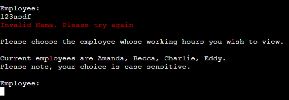

# TIMEKEEPER: Simple Time Keeping Software 

**Developer: Christopher Jimerson**

[Visit Live Site](https://time-keeper.herokuapp.com/)

## About
This project is a simple time management software that helps a user view, change, edit, and calculate hours for employees.

## Table of Contents
  - [Project Goals](#project-goals)
    - [User Goals](#user-goals)
    - [Site Owner Goals](#site-owner-goals)
  - [User Experience](#user-experience)
    - [Target Audience](#target-audience)
    - [User Requirements and Expectations](#user-requirements-and-expectations)
    - [User Manual](#user-manual)
  - [User Stories](#user-stories)
    - [Users](#users)
    - [Site Owner](#site-owner)
  - [Technical Design](#technical-design)
    - [Flowchart](#flowchart)
  - [Technologies Used](#technologies-used)
    - [Languages](#languages)
    - [Frameworks & Tools](#frameworks--tools)
    - [Libraries](#libraries)
  - [Features](#features)
  - [Validation](#validation)
  - [Testing](#testing)
    - [Manual Testing](#manual-testing)
    - [Automated Testing](#automated-testing)
  - [Bugs](#bugs)
  - [Deployment](#deployment)
  - [Credits](#credits)
  - [Acknowledgements](#acknowledgements)

## Project Goals

### User Goals

- Easily view the data for the employees stored in the database
- Easily move through the application with clear response to correct, or incorrect use
- Understand what is asked of me for each part of the application

### Site Owner Goals

- Create an easy to use system for a user to navigate and utilize
- Provide feedback on what a user does, correct or otherwise
- Give examples of data formats that are needed to use the system

## User Experience

### Target Audience

- This is targeted at users that have a small team and need to have an easy way to manage the times of their teams work

### User Requirements and Expectations

- A straight forward and error absent application
- Easy to understand navigation
- Clear purposes to each function
- Feedback from user input

### User Manual

For a more details view of the instructions on how-to-use, click here

### Landing-Authentication
 
When the program starts the user finds themselves on a landing page. This page is requesting the user to log-in. For testing purposes, we only have one current user credentials. The username and password are as follows: 
username: Admin 
password: letMein 

Note: The entry is case sensitive and must 

Once entered correctly, the user is directed to the Employee Select screen.
 
### Employee Select
 
On this screen the user is asked to provide the employee, by name, whose data they wish to access. 
The input again is case sensitve and must match the provided names. 
Once correct, the user will be taken to the main menu. 
 
### Main Menu
 
The main menu provides the user with five options, each one listed numerically in order. 
 
1. View "employee name" Hour 
2. Edit "employee name" Hours 
3. Add Entry to "employ name" Hours 
4. Calculate "employee name" Current Total Hours 
5. Retrun to Employee Select 
 
The user is asked which menu they would like to visit and the bottom of the page shows the requested input to be the chosen menu number. 
Once chosen, and correct, the user will be taken to the menu of choice. 
 
### Menu One
 
This menu is simply a view of the selected employees total hours, organized in chronological order. 
When the user is done, they simply should press enter to return to the main menu. 
 
### Menu Two
 
This menu allows the user to select an entry, by using the instance number in the far left column, to edit. 
Once selected, the user is then taken to a submenu, which is the choice edit menu. 
This menu shows the user their selected entry at the top and then provides the input format for the date and times. 
The user must then input the correct date and clock-in and clock-out. 
Once done, they are given an status update of the success, or failure, of their upload, and then redirected back to menu two. 
 
### Menu Three
 
This menu allows users to add a brand new entry to the employee. 
The user is presented with the correct format that their new data should be in 
Users must input the correct format for a date, clock-in and clock-out. 
Once done the user will be provided a status update of the success, or failure, of their upload and then redirected back to the main menu. 
 
### Menu Four
 
This menu displays to the user the total hours for the selected employee currently in the database.  
It will display the total for a few seconds, and then redirect the user back to the main men.  
 
### Menu Five
This menu navigates the user back to the employee select screen where they are able to choose the which employee they want to access. 

 

[Back to Table Of Contents](#table-of-contents)

## User Stories

### Users

As a user...

1. I want to easily see employee working hours 
2. I want to know what menus are available
3. I want to see what employees are in our database
4. I want the software protected from just having anyone use it
5. I want to be able to edit existing data
6. I want to add new data for an employee
7. I want to know how many total hours are in the database for each of our employees
8. I want to easily navigate back to the beginning
9. I want feedback on my data input
10. I want to know that my changes have been successful

[Back to Table Of Contents](#table-of-contents)

## Technical Design

### Flowchart

## Technologies Used

### Languages
- [Python](https://www.python.org/) programming language for the logic of the program

### Frameworks & Tools
- [Git](https://git-scm.com/) was used for version control within VSCode to push the code to GitHub
- [GitHub](https://github.com/) was used as a remote repository to store project code
- [Google Cloud Platform](https://cloud.google.com/cloud-console/) was used to manage access and permissions to the Google Services such as Google auth, sheets etc.
- [Google Sheets](https://www.google.co.uk/sheets/about/) were used to store players details
- [Code Institute PEP8](https://pep8ci.herokuapp.com//) was used to check my code against Python conventions
- [Heroku](https://www.heroku.com/) was used to deploy this project to a live environment

### Libraries

#### Python Libraries
- datetime - used for date validation
- re - used for time format validation
- os - used to clear terminal
- time - used to displayed delayed messages in the terminal
#### Third Party Libraries
- [gspread](https://docs.gspread.org/en/latest/) - JUSTIFICATION: I used gspread as a mock database to hold the employee data, and list of employees and thus; used the database to read and write from my application.
- [google.oauth2.service_account](https://google-auth.readthedocs.io/en/master/) - JUSTIFICATION: this allows the connection between my application and Google API so that it has the credentials and authorization  to access, and edit, my database(Google sheet)
- [colorama](https://pypi.org/project/colorama/) - JUSTIFICATION: I used this library to add color to the terminal and provide easy visual feedback to the user based on either accepted data entry(green text) or errors(red text)

[Back to Table Of Contents](#table-of-contents)

## Features

### Landing-Authentication
- Provides user with title and welcome
- Gives request to sign-in
- Requests username and password
- User stories covered: 4 

    
Landing Screen Shot

### Employee Select
- Provides list of current employees in database
- Requests users to choose from current list to progress
- User stories covered: 3

    
Employee Select Screen Shot

### Main Menu
- Provides list of the menus the user has access to
- Request menu choice
- User stories covered: 2

    
Screen Shot

### Menu One
- Displays all entries for selected employee
- Data is organized chronologically
- User stories covered: 1

    
Menu One Screen Shot

### Menu Two
- Displays all entries for selcted employee
- This list is organized by instance of addition, not chronological
- Once entry is selected, user may edit the date, clock-in, and clock-out
- User stories covered: 5

    
Menu Two Screen Shot

    
Menu Two Submenu Screen Shot

### Menu Three
- Allows users to add new entry to selected employee database
- Requests the date, clock-in, and clock-out of the new entry
- User stories covered: 6

    
Menu Three Screen Shot

### Menu Four
- Calculates and displays total hours in the database for given employee
- User stories covered: 7

    
Menu Four Screen Shot

### Menu Five
- Navigates the user back to the employee select screen
- User stories covered: 8

    
Menu Five Screen Shot

### User Input Validation
- For every input requested from the user we provide validation
- Green text with success messages display
- Red text with failure messages display
- User stories covered: 9, 10

    
Landing Page Username and Password

    
Employee Select Name Input

    
Main Menu Selection

    
Menu One Return

    
Menu Two Selection

    
Date Input

    
Time Input

#### Clock-Out
 
When the user enters the clock-out time, either through menu three or two, the clock-out must be later than the clock-in. The format must be correct as well, as with the Time Input feature

    
Clock-out Input

    
Input Update

[Back to Table Of Contents](img_directory_here)

## Validation

[Code Institute PEP8 Validation Service](https://pep8ci.herokuapp.com//) was used to check the code for PEP8 requirements. All the code passes with no errors and no warnings to show.

PEP8 Heroku App check for run.py

PEP8 Heroku App check for color.py

## Testing

The testing approach for this code was primarily manual testing of user stories 

1. I want to easily see employee working hours 

| **Feature**   | **Action**                    | **Expected Result**            | **Actual Result** |
| ------------- | ----------------------------- | -------------------------------| ----------------- |
| Menu One | Selection Main Menu Option 1 | Display organized list of data | Works as expected |

Screenshot

 

2. I want to know what menus are available

| **Feature**   | **Action**                    | **Expected Result**          | **Actual Result** |
| ------------- | ----------------------------- | ---------------------------- | ----------------- |
| Main Menu | Navigate to Main Menu | Display list of Menu Options | Work as expected |

Screenshot

 

3. I want to see what employees are in our database

| **Feature**   | **Action**                    | **Expected Result**          | **Actual Result** |
| ------------- | ----------------------------- | ---------------------------- | ----------------- |
| Employee Select | Navigate to Employee Select Screen | View a list of names | Work as expected|

Screenshot

 

4. I want the softrware protected from just having anyone use it

| **Feature**   | **Action**                    | **Expected Result**          | **Actual Result** |
| ------------- | ----------------------------- | ---------------------------- | ----------------- |
| Landing-Authentication | Start Program | Be required to enter valid username/password | Works as expected |

Screenshots

 

5. I want to be able to edit existing data 

| **Feature**   | **Action**                    | **Expected Result**          | **Actual Result** |
| ------------- | ----------------------------- | ---------------------------- | ----------------- |
|  | | | |
|  | | | |

Screenshot

6. I want to add new data for an employee 

| **Feature**   | **Action**                    | **Expected Result**          | **Actual Result** |
| ------------- | ----------------------------- | ---------------------------- | ----------------- |
|  | | | |
|  | | | |

Screenshot

7. I want to know how many total hours are in the database for each of our employees

| **Feature**   | **Action**                    | **Expected Result**          | **Actual Result** |
| ------------- | ----------------------------- | ---------------------------- | ----------------- |
|  | | | |
|  | | | |

Screenshot

8. I want to easily navigate back to the beginning 

| **Feature**   | **Action**                    | **Expected Result**          | **Actual Result** |
| ------------- | ----------------------------- | ---------------------------- | ----------------- |
|  | | | |
|  | | | |

Screenshot

9. I want feedback on my data input 

| **Feature**   | **Action**                    | **Expected Result**          | **Actual Result** |
| ------------- | ----------------------------- | ---------------------------- | ----------------- |
|  | | | |
|  | | | |

Screenshot

10. I want to know that my changes have been successful 

| **Feature**   | **Action**                    | **Expected Result**          | **Actual Result** |
| ------------- | ----------------------------- | ---------------------------- | ----------------- |
|  | | | |
|  | | | |

Screenshot

Number. 

| **Feature**   | **Action**                    | **Expected Result**          | **Actual Result** |
| ------------- | ----------------------------- | ---------------------------- | ----------------- |
|  | | | |
|  | | | |

Screenshot

[Back to Table Of Contents](#table-of-contents)
## Bugs

## Deployment

### Heroku
This application has been deployed from Github using Heroku. Here's how:
1. Create an account at heroku.com
2. Create a new app, add app name and your region
3. Click on create app
4. Go to "Settings"
5. Under Config Vars, add your sensitive data (creds.json for example)
6. For this project, I set buildpacks to and in that order.
7. Go to "Deploy" and at "Deployment method", click on "Connect to Github"
8. Enter your repository name and click on it when it shows below
9. Choose the branch you want to buid your app from
10. If desired, click on "Enable Automatic Deploys", which keeps the app up to date with your Github repository

### Forking the GitHub Repository
1. Go to the GitHub repository
2. Click on Fork button in top right corner
3. You will then have a copy of the repository in your own GitHub account.
   
### Making a Local Clone
1. Go to the GitHub repository 
2. Locate the Code button above the list of files and click it
3. Highlight the "HTTPS" button to clone with HTTPS and copy the link
4. Open Git Bash
5. Change the current working directory to the one where you want the cloned directory
6. Type git clone and paste the URL from the clipboard ($ git clone https://github.com/YOUR-USERNAME/YOUR-REPOSITORY)
7. Press Enter to create your local clone

[Back to Table Of Contents](#table-of-contents)

## Credits

### Code

## Acknowledgements
